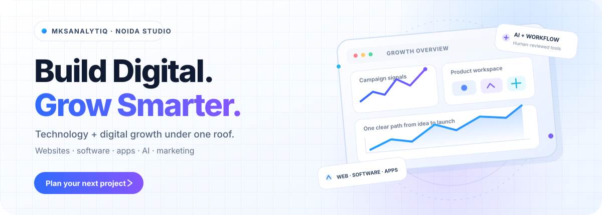

  

  
  
  

  <a href="#services">Services</a> &nbsp;·&nbsp;
  <a href="#selected-work">Selected work</a> &nbsp;·&nbsp;
  <a href="#how-we-work">How we work</a> &nbsp;·&nbsp;
  <a href="#contact">Contact</a>

  <strong>Marketing + technology, under one roof.</strong> 
  A Noida-based studio helping businesses across Delhi NCR and India plan, build and grow digital work.

---

## Services

<blockquote>
Choose a card to expand it, then follow the link to the matching service page.
</blockquote>

<table width="100%">
  <tr>
    <td width="50%" valign="top">
      

        
<strong>01 · Digital Marketing</strong> SEO · ads · social · leads

        
Plan search, Google and Meta campaigns, social content and follow-up around the enquiry you want to earn.

        
<a href="https://www.mksanalytiq.in/services/digital-marketing">Explore Digital Marketing ↗</a>

      

    </td>
    <td width="50%" valign="top">
      

        
<strong>02 · Web Development</strong> Sites · shops · web apps

        
Build a clear public website or web application around the way customers and staff need to use it.

        
<a href="https://www.mksanalytiq.in/services/web-development">Explore Web Development ↗</a>

      

    </td>
  </tr>
  <tr>
    <td width="50%" valign="top">
      

        
<strong>03 · Software Development</strong> Custom tools · SaaS · APIs

        
Shape the brief and written scope before building a tool, workflow or product for your team.

        
<a href="https://www.mksanalytiq.in/services/software-development">Explore Software Development ↗</a>

      

    </td>
    <td width="50%" valign="top">
      

        
<strong>04 · App Development</strong> Android · iOS · cross-platform

        
Plan a mobile product with the screens, integrations and admin needs defined in the project scope.

        
<a href="https://www.mksanalytiq.in/services/app-development">Explore App Development ↗</a>

      

    </td>
  </tr>
  <tr>
    <td width="50%" valign="top">
      

        
<strong>05 · AI &amp; Automation</strong> Chatbots · integrations · workflows

        
Design AI-assisted tools with a clear review step and a person responsible for the output.

        
<a href="https://www.mksanalytiq.in/services/ai-development">Explore AI Development ↗</a>

      

    </td>
    <td width="50%" valign="top">
      

        
<strong>06 · Social Media</strong> Content · reels · community replies

        
Keep a steady presence with a calendar your team reviews before it goes out.

        
<a href="https://www.mksanalytiq.in/services/social-media">Explore Social Media ↗</a>

      

    </td>
  </tr>
  <tr>
    <td width="50%" valign="top">
      

        
<strong>07 · Event Management</strong> Planning · registration · coordination

        
Bring the run of show, vendors, attendee flow and event communications into one plan.

        
<a href="https://www.mksanalytiq.in/services/event-management">Explore Event Management ↗</a>

      

    </td>
    <td width="50%" valign="top">
      
<strong>Not sure where to start?</strong> Tell us what you want to market, build or improve. We’ll help define a first step.

      
<a href="https://www.mksanalytiq.in/contact"><strong>Talk through your brief ↗</strong></a>

    </td>
  </tr>
</table>

  <a href="https://www.mksanalytiq.in/services"><strong>Browse all services on the website →</strong></a>

---

## Selected work

A few public product and software examples. Open a card for its case study, live preview or source repository. Case studies describe published features and leave out unverified outcome figures.

<table width="100%">
  <tr>
    <td width="50%" valign="top">
      
      <h3><a href="https://www.mksanalytiq.in/case-studies/shortgen">ShortGen ↗</a></h3>
      
A multi-workspace SaaS for turning a topic into short-form video.

      
<a href="https://shortgen-pi.vercel.app">Live preview</a> · <a href="https://github.com/SparkxDating/ShortGen">Source</a>

    </td>
    <td width="50%" valign="top">
      
      <h3><a href="https://www.mksanalytiq.in/case-studies/taxpilot">TaxPilot AI ↗</a></h3>
      
Guided ITR-3/ITR-4 preparation with eligibility checks and JSON export.

      
<a href="https://taxpilot-ai-beta.vercel.app">Live preview</a> · <a href="https://github.com/SparkxDating/taxpilot-ai">Source</a>

    </td>
  </tr>
  <tr>
    <td width="50%" valign="top">
      
      <h3><a href="https://www.mksanalytiq.in/case-studies/influencer-os">AI Influencer OS ↗</a></h3>
      
Draft and approve AI influencer content with sponsored-caption disclosure.

      
<a href="https://github.com/SparkxDating/ai-influencer-os">Source repository</a>

    </td>
    <td width="50%" valign="top">
      <h3>More selected work</h3>
      
Explore the wider portfolio and generated case studies for the studio’s public projects.

      
<a href="https://www.mksanalytiq.in/case-studies"><strong>Explore all case studies →</strong></a>

      
<a href="https://www.mksanalytiq.in/portfolio"><strong>Browse the portfolio →</strong></a>

    </td>
  </tr>
</table>

---

## How we work

<table width="100%">
  <tr>
    <td width="34%"><strong>01 · Understand</strong></td>
    <td width="66%">Your goals and challenges</td>
  </tr>
  <tr>
    <td><strong>02 · Plan</strong></td>
    <td>Strategy and roadmap</td>
  </tr>
  <tr>
    <td><strong>03 · Build</strong></td>
    <td>Design and development</td>
  </tr>
  <tr>
    <td><strong>04 · Launch</strong></td>
    <td>Testing and deployment</td>
  </tr>
  <tr>
    <td><strong>05 · Grow</strong></td>
    <td>Support and improvement</td>
  </tr>
</table>

  Clear scope. Regular review points. A handover your team can understand.

---

## Contact

  Have something in mind? Start with a short brief. The website’s contact flow prepares an email or WhatsApp enquiry for you to review and send.

  
  
  

  <strong>Based in Noida · Serving Delhi NCR and India</strong> 
  <a href="tel:+919560814623">+91 95608 14623</a> &nbsp; · &nbsp;
  <a href="mailto:hello@mksanalytiq.in">hello@mksanalytiq.in</a> &nbsp; · &nbsp;
  <a href="https://www.google.com/maps/search/?api=1&amp;query=C-81+C+Block+Sector+8+Noida+Uttar+Pradesh+201306">Open in Maps ↗</a>

---

  
<strong>About the studio</strong>

   
  MKSAnalytIQ is a Noida-based technology and digital growth studio helping businesses across Delhi NCR and India with marketing, web development, software, apps and AI solutions.
    
  <a href="https://www.mksanalytiq.in/about">Meet the studio ↗</a> ·
  <a href="https://www.mksanalytiq.in/process">See the process ↗</a>

  
<strong>Technology and project structure</strong>

   
  <table width="100%">
    <tr><td><strong>Application</strong></td><td>React · TypeScript · Vite · TanStack Start and Router · Tailwind CSS</td></tr>
    <tr><td><strong>Server and data</strong></td><td>Node.js · PostgreSQL via <code>pg</code> · PGLite local fallback when <code>DATABASE_URL</code> is not set</td></tr>
    <tr><td><strong>Public pages</strong></td><td><code>src/routes/</code></td></tr>
    <tr><td><strong>Service and project copy</strong></td><td><code>src/lib/content.ts</code></td></tr>
    <tr><td><strong>Case studies</strong></td><td><code>src/lib/case-studies.ts</code> derives them from the public project list</td></tr>
    <tr><td><strong>Images and SEO</strong></td><td><code>public/media/</code> · <code>src/lib/seo.ts</code> · <code>public/sitemap.xml</code></td></tr>
  </table>

  
<strong>Run the website locally</strong>

   
  <pre><code>npm install
npm run dev
npm run typecheck
npm run build</code></pre>
  <code>npm run dev</code> starts the site on port <code>8080</code>. When <code>DATABASE_URL</code> is set, the build also runs the database migration script.

  © MKSAnalytIQ · Technology · Digital Growth · Software · Noida, India

